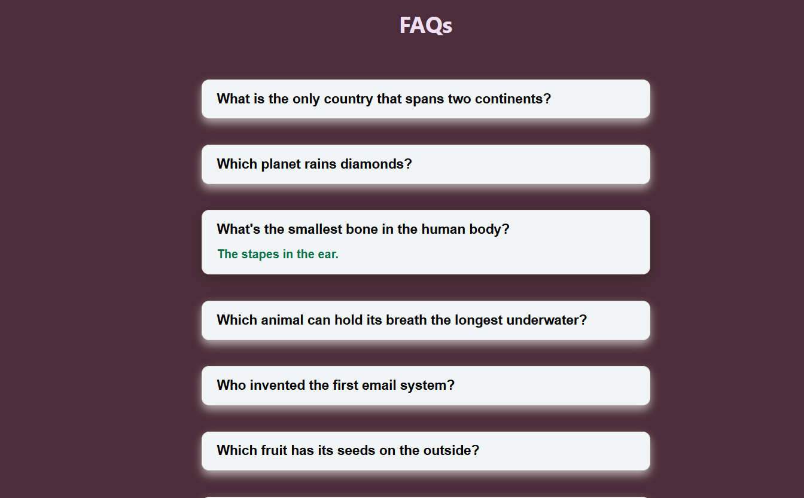

# 📚 FAQ Accordion

A simple **React** application that displays a list of questions and answers. Users can click on a question to expand and view the corresponding answer.

---

## 📌 Features
- ✅ **Accordion-style Layout**: Displays questions, and answers are shown when clicked.
- ✅ **Toggle Behavior**: Opens and closes answers on click.
- ✅ **Clean UI**: Simple design using React and CSS.
- ✅ **Beginner Friendly**: Great for React beginners learning state management and UI components.

---

## 🛠️ Technologies Used
- ⚛️ **React** (`useState` for tracking which FAQ item is open)
- 🎨 **CSS** (`Accordion.css` for styling the FAQ list)
- 📄 **HTML** (JSX structure inside React component)


## 🚀 Live Demo
To see it in action, clone the repository and follow the setup instructions below.

1. **Clone the repository:**

   ```bash
   git clone https://github.com/Eshhaa11/faq-accordion
   
   
2. **Navigate to the project directory:**

   cd  faq-accordion

3. **Install dependencies:**

   npm install

4. **Start the development server:**

   npm start

5. **Open your browser and visit:**

   http://localhost:3000

---

 ## 🎨 Screenshots:
 

 ---

 ## 🤝 Contributing:
 Want to improve this project? Fork the repository, create a feature branch, and open a pull request. All contributions are welcome! 🚀✨
 
 ---

 🎉 Happy Coding!